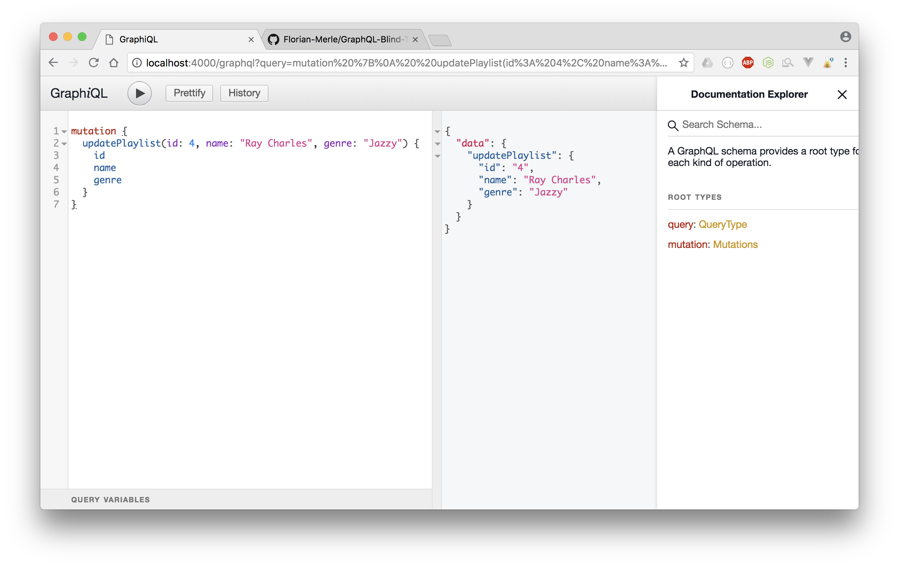

# 🎶 GraphQL Blind Test Server

GraphQL server for a Blind Test application


## 🚀 Main packages & frameworks
- Express
- MongoDB using Mongoose
- GraphQL

## ⚙️ Usage
First customize the .env file like so:
```
MONGODB=mongodb://<username>:<password>@<address>
```

Then start the server using:
```
npm start
```
